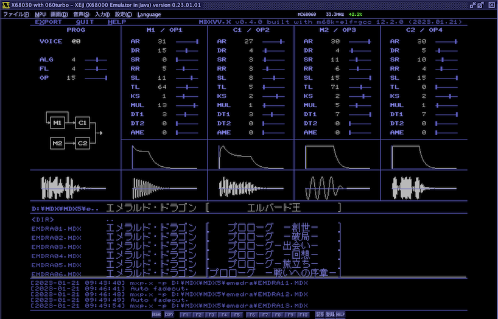
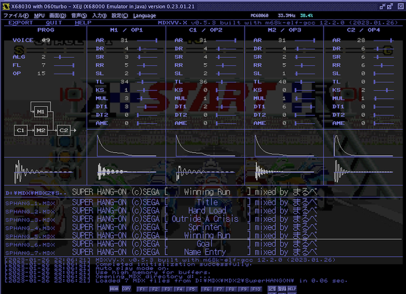
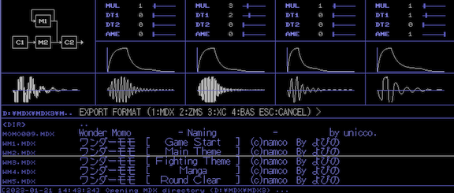
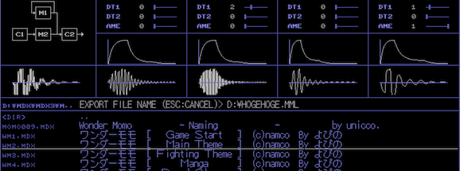
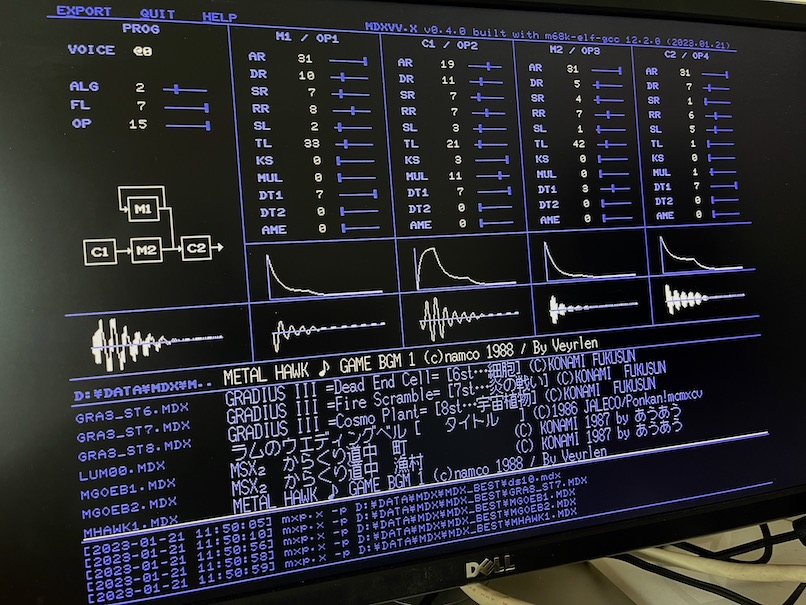

# MDXVV.X (β版)
MDX Voice Viewer for X680x0/Human68k

MDXセレクタ＆プレーヤー＆音色データビュワー＆音色データ抽出ソフトのβ版です。

注意：MDXVVで表示される波形は音色パラメータをそれなりに考慮して計算された結果ではありますが、見た目のみで実際には厳密なものではありませんのでご了承下さい。

注意：低クロック機ではもたつきなどが発生します。できるだけXVI(16MHz)、いやRedZone(24MHz)相当以上でお使いください...。メモリも最低4MBは必要です。エミュレータ上ではMC68000 24MHz/4MBあればほぼこちらの期待する最低限の動きになることを確認しています。推奨は060turboまたはPhantomXです(ぉ

---

## Install / インストール

[MDXVV060.ZIP](https://github.com/tantanGH/mdxvv/raw/main/MDXVV060.ZIP) をダウンロードして展開し、MDXVV.X をパスの通ったディレクトリにコピーします。

PCM8とMXDRVの常駐が必要です。
MXDRVバージョン2.06+16が常駐していない場合はエラーメッセージが出てMDXVVは起動しません。

PCM8およびMXDRVはいずれもX68000 LIBRARYより入手可能です。

* http://retropc.net/x68000/software/sound/adpcm/pcm8/
* http://retropc.net/x68000/software/sound/mxdrv/

画面の描画にIOCSコールを多用しているので、YuNKさんのHIOCS.XなどIOCSを高速化するソフトウェアの導入を強く推奨します。

* http://retropc.net/x68000/software/system/iocs/hiocs/

---

## How To Start / 起動方法

    mdxvv [options] [mdx-directory-name]

MDXファイルが格納されているフォルダを指定して起動します。
指定が無い場合はカレントディレクトリが指定されたものとして扱います。
MDXファイルそのものを指定しても構いません。その場合はそのMDXファイルがあるフォルダからの起動になります。

M.Kamadaさんの `060loadhigh.x` による 060turbo / PhantomX ハイメモリ上での実行にも対応しています。(`060turbo.sys`の組み込みが必要)

    060loadhigh mdxvv [options]

* http://retropc.net/x68000/software/hardware/060turbo/060loadhigh/

オプションとして以下の指定が可能です。

 

* `-g`

グラフィック画面の初期化を行いません。壁紙画像を維持したい場合などに。MDXVV自体はテキスト0,1プレーンのみを使用します。

 

* `-u`

060turbo / PhantomX のハイメモリをバッファとして使用します。`060loadhigh.x` を使用した場合でも指定が必要です。
`060loadhigh.x` ではなく `060high.x` でアロケートもハイメモリから行う指定で実行した場合は不要になります。

 

* `-f<n>`

自動演奏モードの際、n (秒数) で指定された時間が経過すると曲をフェードアウトして次に進みます。

 

* `-a`

自動演奏モードをOFFにして起動します。起動後も `a` キーで ON/OFF を切り替えることができます。

 

* `-w<n>`

波形アニメーション速度を変更します。値が小さいほど速くなります。デフォルトは3。MPUの処理が追いつかず処理落ちする場合などは値を大きくしてみてください。

波形アニメーション例：

---

## Key Bindings / 操作方法

操作はすべてキーボードで行います。

 

- `h`

主要な操作に関するヘルプメッセージを表示します。

 

- `ESC`
- `q`

MDXVVを終了します。

 

- `CR`
- `ENTER`
- `CTRL+m`

カーソルバーの位置のMDXを再生し、音色データを表示します。カーソルバーがディレクトリを指していれば、そのディレクトリに移動します。

 

- `SPACE`

カーソルバーの位置のMDXを再生し、音色データを表示すると共にカーソルバーを一つ下に移動します。ディレクトリ移動は行いません。

 

- `BS`

カーソルバーの位置のMDXを再生し、音色データを表示すると共にカーソルバーを一つ上に移動します。ディレクトリ移動は行いません。

 

- `TAB`

一つ後の音色データを表示します。

 

- `SHIFT+TAB`

一つ前の音色データを表示します。

 

- `RIGHT`

一つ後のドライブを選択します。

 

- `LEFT`

一つ前のドライブを選択します。

 

- `UP`
- `k`
- `CTRL+p`

カーソルバーを上に1つ移動します。

 

- `DOWN`
- `j`
- `CTRL+n`

カーソルバーを下に1つ移動します。

 

- `ROLLUP`
- `CTRL+f`
- `CTRL+v`

ページ送りを行います。

 

- `ROLLDOWN`
- `CTRL+b`
- `b`

ページ戻しを行います。

 

- `HOME`
- `<`

リストの先頭にジャンプします。

 

- `UNDO`
- `>`

リストの最後にジャンプします。

 

- `r`
- `R`

リストのソート順を反転させます。

 

- `.`

一つ上のディレクトリに移動します。

 

- `\`

ルートディレクトリに移動します。

 

- `s`

曲を中断します。

 

- `c`

曲を再開します。

 

- `f`

曲をフェードアウトします。自動演奏モードの場合はフェードアウト完了後に次の曲に進みます。

 

- `p`

曲を再生します。

 

- `e`

曲を終了します。自動演奏モードの場合は次の曲に進みます。

 

- `a`

自動演奏をON/OFFします。

 

- `A`

大文字 `A` (`SHIFT+a`) です。波形アニメーション表示をON/OFFします。

 

- `S`

大文字 `S` (`SHIFT+s`) です。シャッフルモードをON/OFFします。

 

- `M`

大文字 `M` (`SHIFT+m`)です。MMDSP を起動します。MMDSP を終了させると MDXVV に戻ります。MMDSP.r および COMMAND.X にパスを通しておく必要があります。

 

- `x`
- `X`

音色データのエクスポートを行います。

---

## Voice Data Export / 音色データのエクスポート

音色データが表示されている状態で `x` キーを押すことで、音色データをファイルに書き出すことができます。

フォーマットは4通り選択できます。

1. MDX
2. ZMS (Z-MUSIC)
3. XC
4. BAS (X-BASIC)

`1`から`4`のいずれかのキーで選択してください。なお、ハードウェアLFO関連パラメータは一切無視されます。

続いて書き出し先のファイル名を直接入力してください。日本語フォルダ・日本語ファイル名は使わないでください。既に既存のファイルがある場合は確認を求められます。

出力される音色データは曲データに含まれるすべての音色になります。

---

## Background Image / 背景画像サポート

スキャン対象となるディレクトリ内に、`MDXVV_BG.MAG` または `MDXVV_BG.PNG` という名前で画像ファイルが置かれていて、かつ環境変数でローダが設定されている場合は子プロセスでローダを呼び出して背景画像として表示します。

    SET MDXVV_MAG=MAGH.X /O /X /E /L3 /V40
    SET MDXVV_PNG=PNGEX.X -c -n -v40

それぞれのローダと`COMMAND.X`にパスが通っている必要があります。

---

## Limitations / 制約事項

日本語の含まれるファイル名は再生・音色表示は可能ですが、画面上正しく表示できません。曲タイトルについては表示可能です。

---

## Special Thanks

開発にあたり以下のソフトウェア・ハードウェア・環境を利用させて頂きました。ありがとうございます。

* クロスコンパイル
  * [xdev68k](https://github.com/yosshin4004/xdev68k/) ([gcc 12.2.0に変更](https://github.com/tantanGH/distribution/blob/main/INSTALL_xdev68k_M1Mac.md)) Thanks to ファミべのよっしんさん
  * HAS060.X on run68mac Thanks to YuNKさん / M.Kamadaさん / GOROmanさん
  * HLK301.X on run68mac Thanks to SALTさん
  * SHARP XC 2.1 ライブラリ
  * Microsoft Visual Studio Code
  * Apple MacBook Air (2020, Apple Silicon, RAM8GB, SSD512GB)

* エミュレータ
  * [XEiJ](https://stdkmd.net/xeij/) Thanks to M.Kamadaさん

* 実機
  * SHARP X68030
  * 満開製作所 060turbo
  * DELL P2314H モニタ

* 書籍
  * [Inside X68000, 桒野雅彦, ソフトバンク, 1992年](https://amzn.asia/d/6IA3urZ)
  * [サウンドプログラミング入門, 青木直史, 技術評論社, 2013年](https://amzn.asia/d/5Jqxlwu)

* その他
  * [MMDSP](https://github.com/gaolay/MMDSP/)
  * [ChatGPT](https://openai.com/blog/chatgpt/)

---

## Terms Of Use / 免責

ここで配布されているソフトウェアを使用したことにより何らかの不具合(システムクラッシュその他)が生じても、一切の責任は負えません。自己責任にてご利用ください。
アーカイブの再配布は不具合が見つかった時に収拾がつかなくなるのでなるべくご遠慮ください。ただしこの github のリンクの紹介は自由です。

---

## Contact / 連絡先

tantan
 - GitHub: https://github.com/tantanGH/
 - Twitter: https://twitter.com/snakGH/

---
